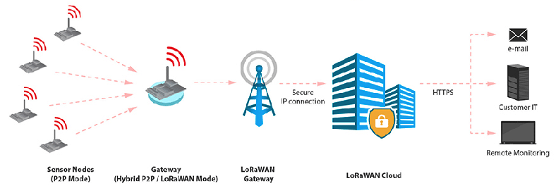

# What is IoT
The Internet of Things (IoT) connects everyday devices to the internet, enabling them to collect and share data. 
Think of IoT as giving your devices the ability to "talk" to each other and you! IoT is concept where physical object like 
vehicles, machines or even enviromental elements like soil and water are embedded with sensors. These objects can collect 
data and provide them to the end user in the form of analyses and alerts. 

# Network
At Heliotics we use Low Power Wide Area Networks like LoRaWAN and NB-IoT. The main advantages of these networks are their
durability and signal quality. Average size of data transported ranges from few bytes to a few hundred bytes per 
message. As a results, devices can operate with extended battery life, lasting up to 10 years. High signal penetration 
through objects like walls, steel and basements is the reason for the signal range of 5-20 km per gateway.

# What is LoRaWAN
LoRaWAN stands for Long Range Wide Area Network. It is designed specificaly for low-power wide area network (LPWA) wireless
networks that use LoRa. LoRaWAN is radio frequency network with stable coverage up to 5km in urban areas and 20km in open
land. Low energy consumption for data transmission leads to lifetime up to 10 years for one sensor.

# How LoRaWAN works

Sensors that are used to monitor objects or space collect data regularly (hourly, daily, weekly) or when conditions are met 
and alert is triggered. These data are sent to the nearest LoRaWAN gateway. From here is data sent to cloud service, from 
where it is used for visualization in mobile or desktop application for end user. 

# NB-IoT
NB-IoT stands for Narrow Brand Internet of Things. It is a low-power communication technology designed for IoT devices. 
Main difference compared to LoRaWAN is that NB-IoT uses mobile operators infrastructure (4G, 5G) to communicate whereas 
LoRaWAN sensors use their own network. NB-IoT is most commonly used in cases where devices and applications require stable
and reliable connection and in cases where the area is not covered by LoRaWAN gateways to provide signal. 

# LoRaWAN Gateways
LoRaWAN gateways are bridges between IoT devices and cloud service where date is processed. A single gateway can cover 2-5 km 
in urban areas and 10-20 km in rural areas. Unlike other networks, with a few gateways you can create network that can cover 
required area. 

