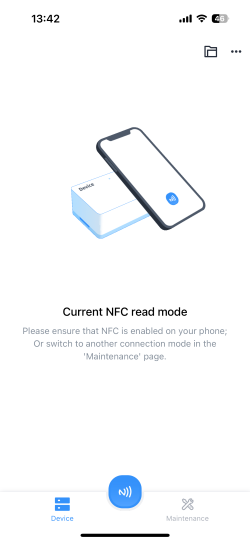
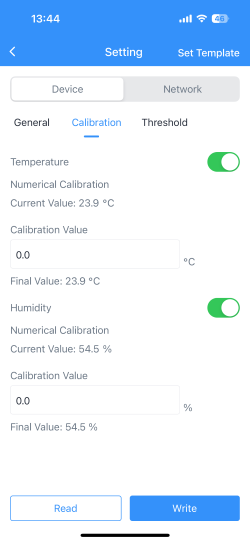
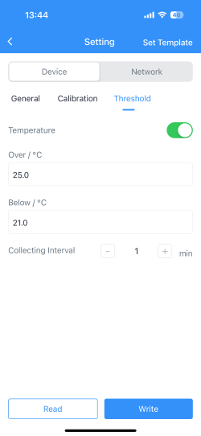

# ToolBox app
To view basic information about your sensor and adjust settings like reporting interval, sensor calibration, information threshold
,you need to download ToolBox application to your device. 

          

# Add sensor 
After installing ToolBox app use your mobile phone device and place your phone near the sensor (nfc is usually located in the top part of the phone)

     

# ToolBox dashboard
After successfully adding your sensor, you can see your device in dashboard

    

From here you can navigate to basic information and settings

# Settings

    

In part general you can change your temperature unit from °C to °F. Changing reporting interval will change how often 
the sensor will send collected information to server for further analysis.

    

Calibration settings ensure that the sensor provides accurate, reliable, and repeatable data, making it 
suitable for precise measurements in different use cases.

     

Sensor will upload current data instantly when temperature reaches your preset threshold values

# User Guide

For more precise information about your sensor and for user guide visit: https://www.milesight.com/
