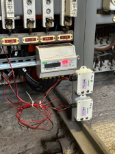

# Types of sensors we use at Heliotics

At Heliotics, we use a wide range of IoT sensors, specially designed for the need of your use. All our sensors are 
compatible with LPWAN technologies such as LoRaWAN and NB-IoT, ensuring secure, long-range and long lasting communication.
We are ready to deploy sensors from leading vendors like **Milesight**, **Dragino** and more.

# Industry Monitoring 

Industry offers a wide selection of sensors like vibration and shock sensors that can also monitor temperature, humidity,
downtimes, remote reporting. Monitoring production processes can optimize operating cost and save unexpected expenses.

# Vastum- Smart Waste & Material Management     

Vastum provides a flexible and reliable solution for waste or material management using IoT sensors and LPWAN to monitor 
containers in real time. For waste management we deploy ultrasonic, Time-of-Flight and radar sensors capable of measuring 
depths of up to 4,500 mm with high accuracy. These types of sensors also include tilt detection for monitoring container 
orentation. 

                              

# Energy Monitoring- Smart Energy Management        

Energy monitoring solution rely on sensors for tracking electricity, gas and water consumption. These types of sensors also
incorporate leakage detection to prevent resource wastage. Energy monitor software provides early information to avoid 
unnecessary expenses and unxpected downtimes. 

                    

# Level Monitoring- Smart Level Monitoring 

Level Monitoring provides advanced sensors and software to measure volume, level, pressure and flow. These are applied in 
monitoring underground and overground tanks, reservoirs containing water, oil and all kinds of liquids. This technology 
minimizes losses and ensures efficient inventory management. 

                   

# Ubis- Smart Location Tracking    

Ubis provides real-time data of any asset like goods, cars and more. Our software in cooperation with various sensors combination,
enable to set up alerts for entering or exiting a specific location and monitor your assets effectively.

                       

# Terra- Smart Enviro Monitor         

We use advanced temperature and humidity sensors, air quality monitors for CO2, dust, and fumes, as well as noise sensors. 
These are deployed in projects like smart city monitoring and industrial workplace safety to ensure optimal ambient 
conditions. Terra also offers real-time monitoring through LPWAN. Inteligent software optimizes planning and reduces 
maintance cost. 

                      

**List of Milesight IoT sensors:** https://www.milesight.com/iot/

**List of Dragino IoT sensors:** https://www.dragino.com/products/products-list.html

